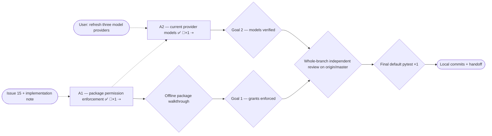

# Issue 15 permissions and current models — implementation plan

Sources: [issue #15](https://github.com/tyxter-dev/blackbox/issues/15), including its September 3 implementation note; user request to update Anthropic, OpenAI and xAI models; PRD sections 4, 8.4, 12 and 17; ROADMAP.md.
Written: 2026-09-05.
Feature map: flat repository; scout found 440 files, no recognized feature units. Generated map and review reports live in `/tmp`, outside the commit.

## Premise corrections

- `permissions=[]` cannot distinguish omission from an explicit empty grant list: src/blackbox/workspace_agents/spec.py:83 and src/blackbox/workspace_agents/serialization.py:90. Use explicit versioned enforcement.
- The package bridge has both model and agent provider branches: src/blackbox/workspace_agents/runtime.py:45. Both need acceptance fixtures.
- LocalAgentProvider shares AgentLoop but constructs its own exposure list: src/blackbox/providers/agent_adapters/local.py:125. A high-level runtime-only patch would leave this path unprotected.
- Contrary to stale AGENTS.md guidance, `tests/e2e` already contains `test_diet_coach_example.py`; include these tests in every section global gate.
- The upstream default branch is `origin/master`, not `origin/main`; baseline `a95ad79ea167c6ea6b8066fa5979568dd91e402d`.
- The current focused baseline is 709 passing, rather than the older count in AGENTS.md. The initial environment lacked locked dev extras; after `uv sync --locked --extra dev`, all three gates pass.
- Provider model metadata and token pricing are separate catalogs, both dated May 6: src/blackbox/providers/catalog.py:8 and src/blackbox/pricing/catalog.py:9. Refresh both and preserve their distinct roles.

- The model mapper's initial catalog-only suggestion for OpenAI/xAI was incomplete: fetched official effort values require model-specific request validation as well.

- Grok 4.3 already has an identity row in the baseline; it needs missing pricing and refreshed verified provenance, not a duplicate identity. A root dispatch misstatement was corrected against git show before implementation depended on it.

- A2 review found legacy Anthropic replay unintentionally changed by the Fable guard. Root also found missed OpenAI migration guidance: Astra sampling/logprob restrictions, GPT-5.6+ cache TTL field changes and native cache-write accounting. R1 narrows replay and completes these model contracts using fetched official guidance. The accounting reader sweep also confirmed a pre-existing Anthropic mismatch: exclusive native input was passed to an estimator that subtracts cache counts; normalize inclusive input/total while retaining native usage in provider_details.

## 0. Execution contract

### Roles

Main session plans, reviews, verifies and commits; all product edits belong to the sole implementer. Mappers and reviewers are read-only. Sections execute sequentially.

### Harness routing

| Role | Requested | Role-confirmed | Model/effort-confirmed | Fallback used |
| --- | --- | --- | --- | --- |
| Implementer | gpt-6-astra / low | Generic implementer accepted; scratch task returned READY | Explicit selector accepted; effective runtime metadata unavailable | Direct pinned route; attestation none |
| Mapper | gpt-5.6-luna / max | Generic read-only mapping tasks accepted | Explicit selector accepted; effective runtime metadata unavailable | Direct pinned route; attestation none |
| Reviewer | gpt-5.6-terra / high | Independent preflight review returned APPROVE | Explicit selector accepted; effective runtime metadata unavailable | Direct pinned route; attestation none |

### Global gate

```bash
uv run --no-sync pytest -q tests/unit tests/runtime tests/contracts tests/golden tests/e2e
uv run --no-sync ruff check src tests examples
uv run --no-sync mypy --strict src
```

Baseline result: 2026-09-05, existing focused suite exit 0, 709 passed in 7.26s; Ruff all checks passed; mypy success, 170 source files. `tests/e2e` already contains a diet-coach example walkthrough and will also hold the package-permission walkthrough. Final acceptance also runs `uv run --no-sync pytest -q`.

### Execution-environment preflight

Preflight status: ready
Checked: 2026-09-05
Baseline SHA: a95ad79ea167c6ea6b8066fa5979568dd91e402d
Execution realm: local Linux checkout, Python 3.13.5, locked dev environment

| Capability | Probe / expected condition | Observed evidence | Classification |
| --- | --- | --- | --- |
| Worktree and branch | Clean original checkout; isolated feature branch | feat/issue-15-workspace-permissions-models, no original changes | ready |
| Toolchain and agent routing | Python, uv, Node, independent workers | Python 3.13.5, uv 0.10.10, Node 24.20.0; all roles dispatched | ready |
| Required infrastructure | Offline tests only | No external services required; fake MCP available | ready |
| Credentials / external authority | No paid calls required | Official documentation and git reads work; no provider credentials consumed | ready |
| Host resources | Writable checkout and caches | Locked environment installed successfully | ready |
| Running stack freshness | Test process imports this checkout | pytest pythonpath=src | ready |
| Baseline gate | Required gates pass with locked dev extras | 709 tests; Ruff and mypy green | ready |

#### Known blockers

| Condition | Detection | Pre-approved handling |
| --- | --- | --- |
| Missing optional SDK stubs in bare environment | mypy import-not-found | uv sync --locked --extra dev, then use --no-sync for gates |
| uv cache hardlink crosses filesystems | uv warning | Copy fallback; no product change needed |
| Official Markdown rejected by web renderer | unsupported text/markdown | Read public Markdown with urllib; keep official URL and retrieval date |

### Expensive or mutating lifecycle gate budget

| Gate | Consumes / invalidated by | Planned runs (impl / orch) | Preflight | Actual runs | Why this count is safe |
| --- | --- | --- | --- | --- | --- |
| Baseline focused tests | Original source and locked environment | 0 / 1 | proven | 1 | Establish clean reference after setup |
| Section global gates | Source, tests, catalogs, docs | 2 / 2 | proven | 12 | One implementation and independent acceptance per section; corrections justify reruns |
| Offline package walkthrough | Shared loop and package policy | 1 / 1 | proven through existing scripted loop tests | 2 | Implementer/root acceptance embedded in A1 suites; repeated executions counted under global gates, no separate invocation |
| Final default pytest | Reviewed final checkout | 0 / 1 | proven focused baseline; network tests are gated | 0 | Once after whole-branch review |
| Provider live calls / deployment | External credentials | 0 / 0 | not-required | 0 | Offline acceptance requested and sufficient; no deployment scope |

### Rulings

#### Floor rulings (the user owns these)

| # | Section | Decision | Options | Recommendation | Ruling |
| --- | --- | --- | --- | --- | --- |
| F0 | all | Repository-declared floor in AGENTS.md | Follow existing contracts | No rename, new facade, dependency, MCP trust primitive, or sweeping product redline | No unresolved floor items; user authorized issue implementation |
| F1 | all | Stable errors | Reuse ConfigurationError / UnsupportedFeatureError and canonical policy denial results | Reuse existing families | Within requested enforcement scope |
| F2 | all | Terminal action | Local commits | Two reviewable slice commits, final verification ledger commit and report | Authorized implementation scope; no publication required |

#### Recorded calls (orchestrator-ruled under the floor, user-vetoable)

| # | Section | Call | Rationale |
| --- | --- | --- | --- |
| R0 | all | ⇢ lane: full | Shared policy, registry and serialization readers disqualify bounded lane |
| R1 | A1 | ⇢ permission_mode = inherit or allowlist_v1; default inherit | Issue comment requires versioning and compatibility; allowlist empty denies all tools |
| R2 | A1 | ⇢ Negative space: ordinary run/stream and inherit packages keep existing behavior; allowed tools execute and continue; final output, failure results, approval/cancel/cleanup remain usable | Enforcement must preserve the blackbox loop and legitimate workflows |
| R3 | A1 | ⇢ Grants intersect with existing runtime, approval and MCP trust policies; caller overrides may narrow but cannot remove package constraints | Prevent override, lazy-loader and native-payload bypasses |
| R4 | A1 | ⇢ Tool scopes and connector identity come from trusted registry/server/workspace/configuration metadata, never model arguments or grants alone | Prevent self-authorizing a requested operation; document conservative fallback for unannotated tools |
| R5 | A1 | ⇢ Local model turns and LocalAgentProvider must enforce; unsupported managed surfaces fail before create/start/staging; hosted configuration is filtered or rejected when native constraints cannot express the grant | Matches issue's capability-honesty requirement; no fake local hosted tools |
| R6 | A1 | ⇢ One cohesive permission slice | Exposure and dispatch must ship together; an intermediate opt-in mode that silently permits a sibling surface is unsafe |
| R7 | A2 | ⇢ Refresh supported text/tool model inventory, lifecycle, rates and model-specific capability recognition using official sources; preserve user overrides and existing model choices | User requested new models; no default migration or new audio/image backend is needed |
| R8 | all | ⇢ Reuse independent reviewer handles sequentially when the tool thread cap prevents a third new reviewer | Three section lenses still run independently of the writer and root; direct-pinned reviewer routing is retained |
| R9 | A2 | ⇢ Reject supplied top_k on verified new Claude models; preserve supported default temperature/top_p and document conditional tool choice | No authoritative top_k default sentinel was established; explicit bounded rejection is truthful and avoids guessing |
| R10 | A2 | ⇢ Use current OpenAI cache TTL mapping and existing cache-creation usage field; reject Astra unsupported controls before dispatch | Model refresh must preserve usable request construction and truthful cost estimates; no public schema or dependency change |
| R11 | A2 | ⇢ Normalize Anthropic input/total to include cache counts, preserve exclusive native fields in provider_details | Generic ModelUsage pricing subtracts cache counts; aligning the adapter fixes underpriced cached Claude requests without changing raw payloads or adding a schema flag |

### Base drift policy

Fetch `origin/master` before whole-branch final review; merge it if ahead, preserving local commits. Re-run invalidated gates after merge. No stacked predecessor or pushed history rewrite.

### Rules

- One implementer, no nested workers. Keep its handle for corrections and sequential sections.
- Every product change includes matching current documentation and meaningful acceptance tests.
- No unrun check counts; fake-based regression checks include local sensitivity evidence, restored before normal gates.
- Main session reads complete diffs and independently reruns gates. Review uses at least three lenses including doc-truth, and security for A1.
- Preserve original changes; none existed. Generated maps, reports and logs are temporary artifacts.

## 1. Goals — observable definition of done

### Goal 1 — Permission enforcement

- [x] Old manifests hydrate to inherit and non-packaged runs retain existing behavior.
- [x] allowlist_v1 with zero grants exposes and executes no user tools; a correctly granted local tool completes through the same loop.
- [x] Wrong refs, scopes and connectors are omitted before exposure and rejected before execution, including dynamic load, stale calls, MCP and workspace operations; failure items preserve continuation.
- [x] Equivalent package fixtures exercise model runs and local sessions; managed providers without equivalent enforcement fail before startup. Hosted native limitations are explicit and cannot weaken the package.
- [x] PolicyRequest metadata is authoritative and consistent, approvals/trust remain enforced, and an offline end-to-end package walkthrough proves positive and negative behavior.
- [x] FEATURES, ROADMAP, VALIDATION and relevant package docs accurately describe enforcement and limitations.

### Goal 2 — Current provider models

- [x] Officially verified current OpenAI, Anthropic and xAI text models resolve in the provider model catalog with source date, lifecycle, capacity and supported capability metadata.
- [x] Their standard token and cache rates resolve through bundled pricing and aliases, while user overrides still win and unsupported rate dimensions remain documented.
- [x] Targeted catalog/capability tests and global gates pass; current model support does not silently alter existing model selections.

## 2. Topology graph and recommended order

### Topology graph



### Graph Findings

Resolved before execution:

- Partially consumed input / sibling surfaces: explicit model, local session, hosted config/handler, dynamic catalog, MCP and workspace matrix in A1; no separate permission execution path.
- Negative space / ruling completeness: R1–R5 define defaults, admitted flows, trusted inputs and unsupported provider handling. No repository floor item remains.
- Plan as evidence: source anchors checked against baseline; generated map is flat and does not claim package ownership boundaries it failed to detect.
- Gate environment / known blockers: locked dev extras resolve the initial mypy setup mismatch; tests execute offline in this checkout.
- Data path / constraint admissibility: manifest hydration and registration are the production writers; versioned mode validated explicitly, default remains compatible.
- Structural classes: no orphan input/section/goal, cycle, false hard dependency, convergence bottleneck, or gateless handoff. A2 follows A1 only to maintain one writer and reviewable commits.
- No DB migration, limiter, shared queue, deployment, tenant demand count, build-time secret or rollout window; these checklist classes do not apply.

Accepted risks:

- Reader sweep: package mode and policy metadata cross packages. Enumerate hydration, package manifests, registries, scheduling, model bridge, local sessions, MCP, hosted handler and prompt/routing readers; tests cover both policy admission and denial. Relevant anchors below.
- Provider equivalence: native managed tools may not have pre-dispatch hooks. Fail typed before side effects, document exact boundary, and test provider create/start spies remain untouched.
- Model evidence: official docs can disagree or omit limits; retain unknown fields rather than inventing precision. Restricted models must not be presented as generally available. Current Claude documentation establishes adaptive thinking and sampling restrictions, Fable 5.1 forced-tool/prefix restrictions, and an Opus 5 web-fetch limitation. A2 must validate these supported controls honestly; retain native thinking blocks unmodified.
- Routing attestation: explicit model/effort selectors are accepted, but effective runtime metadata is unavailable. Independent pinned reviewers still review final code.
- Test sensitivity / evaluator soundness: fake-loop tests must fail when the policy constraint is disabled; walkthrough checks outputs and side effects, not merely completion status.

Reader sweep:

- Package fields: src/blackbox/workspace_agents/serialization.py:72, src/blackbox/workspace_agents/spec.py:109, src/blackbox/workspace_agents/validation.py:40 and src/blackbox/workspace_agents/runtime.py:17; inspect registries, package export and scheduling as dependents.
- Policy metadata: src/blackbox/runtime/tool_routing.py:404, src/blackbox/runtime/agent_loop.py:734, src/blackbox/mcp/connector.py:827 and src/blackbox/tools/hosted_runtime.py:88; authoritative metadata must survive each boundary.
- Catalog identities: src/blackbox/providers/model_catalog.py:49, src/blackbox/pricing/catalog.py:56 and src/blackbox/workspace_agents/validation.py:374; inspect capability selectors, accounting and lifecycle example for changed assumptions.

A1 trace: modeled exposure/dispatch and provider equivalence risks occurred and were handled. Missed by initial implementation: typed native tool-search control synthesis and approval-retry context; custom workspace prefixes also needed explicit identity metadata. R1 resolved all three. A2 trace: model-specific controls/provenance risks occurred. Initial evidence missed OpenAI migration requirements; the late accounting reader sweep found exclusive Anthropic counts incompatible with generic pricing. R1 corrected these and bounded Fable replay after scope/doc review. The section-global budget overran 4 planned runs to 12 actual (A1: implementer 3/root 2; A2: implementer 5/root 2). Initial lint/setup adjustments, missed API constraints, review defects and a final capability-profile correction explain this >1.5× overrun; future planning must check migration guides and native-response-to-price flows before first gates. Two additional early A1 structural-only runs are supplemental, not full three-command gates. Final branch trace comparison remains pending.

### Corrections in force

Premise corrections above apply from the outset. Public lowering, Local generator yield contexts and native capability delegation are additional A1 readers. Sensitive fixtures must prove the intended fault: the original timeout scheduling and redundant managed-gate probes survived initial mutations and were corrected before acceptance.

R1 review corrections accepted: workspace permission identity must be independent of configurable public prefixes; a workspace approval retry must keep the package approval snapshot; typed controls that synthesize native tools must pass the final package configuration guard. Anchored independent reports and root verification establish all three defects.

### Hard dependencies

None between implementation sections. Whole-branch review consumes both accepted sections.

### Soft dependencies

A2 follows A1 to keep the sole writer sequential and produce distinct commits.

### Recommended linear order

A1 -> section gates/review/commit -> A2 -> section gates/review/commit -> refresh origin/master -> whole-branch review -> final default pytest -> handoff.

## 3. Sections

## A1 — Enforce workspace agent package permissions

GOAL:
Package grants constrain exposure and fresh dispatch on controlled surfaces while ordinary runs retain compatibility.

SOURCES:
Issue #15, all scope/acceptance clauses and September 3 comment; PRD 4/8.4/12/17; ROADMAP package permissions gap.

TARGET:
blackbox flat scout unit; owning packages workspace_agents, runtime, tools, mcp, workspaces, core and providers/agent_adapters. Relevant READMEs, README.md, FEATURES.md, ROADMAP.md, tests/VALIDATION.md and CHANGELOG.md receive focused changes.

DEPENDS ON:
none

IMPLEMENTER PROFILE:
Generic direct-pinned implementer / gpt-6-astra / low; same handle for corrections.

CONTEXT TO AGGREGATE:

1. Package declarations and bridge: src/blackbox/workspace_agents/spec.py:68, src/blackbox/workspace_agents/permissions.py:55, src/blackbox/workspace_agents/runtime.py:17.
2. Exposure and dispatch: src/blackbox/runtime/tool_routing.py:404, src/blackbox/runtime/agent_loop.py:308, src/blackbox/runtime/main.py:2374.
3. Sibling paths: src/blackbox/providers/agent_adapters/local.py:125, src/blackbox/tools/hosted_runtime.py:88, src/blackbox/mcp/connector.py:400.
4. Tests: tests/runtime/test_local_agent_provider.py:1, tests/runtime/test_runtime_run.py:1, tests/contracts/test_capability_honesty.py:1; extend source-mirrored package units and add offline tests/e2e walkthrough.

WRITERS:
WorkspaceAgentSpec construction/hydration in spec.py and serialization.py; package expansion in runtime.py; global/isolated ToolRegistry registration; MCPConnector materialization; workspace registration; runtime dynamic and late-bind plans; LocalAgentProvider stream_factory. Verify their readers described above and return additional discovered anchors.

SIBLING SURFACES:
Model run/stream, local sessions, scheduling through package bridge, native cloud/Codex/Claude/Vertex sessions, hosted config and client handlers, raw provider extras, MCP local/native, dynamic tools and hidden finalizer/meta-tools.

LIFECYCLE / GATE EFFECTS:

- Produces: serialized permission mode, compiled immutable constraints and denial events/results.
- Binding: per-run/per-session, never mutable global policy state.
- Consumed by: section global gates and offline package walkthrough.
- Invalidates prior evidence from: baseline permission behavior tests only; no external state.

IMPLEMENT:

- Add validated permission_mode inherit(default) / allowlist_v1 to WorkspaceAgentSpec, preserve old manifest hydration/roundtrip and inherited behavior. Compile opt-in grants without deriving mode from presence of permissions.
- Enforce ref, required scope and connector binding before every controlled exposure and immediately before actual dispatch, including dynamic discovery/load and late materialization. Centralize semantics in existing policy/loop seams; use authoritative metadata and conservative documented defaults for unannotated tools.
- Compose package restrictions with user/runtime/approval/workspace/MCP trust policies. Prevent kwargs/config/native extras or alternate tool spellings from replacing the package boundary. Preserve canonical policy/tool-choice denial events and useful failed result items for synthetic or stale calls.
- Support equivalent enforcement in LocalAgentProvider through shared execution. Reject unsupported provider-managed packages with existing typed errors before agent creation, session startup or skill/workspace side effects. Configuration filtering for provider-executed hosted tools is allowed only where it fully represents the grant; otherwise reject it explicitly. Client-hosted handlers need dispatch checks.
- Preserve legitimate grants, internal final output/continuation, cancellation and approvals. Do not bypass MCP trust, introduce another loop, add a facade/dependency, or repurpose load-bearing contracts.
- Add unit, runtime, contract and offline end-to-end positive/negative fixtures for every implemented surface, including wrong scopes/connectors, deny-all, overrides, dynamic calls, fresh registry resolution and managed fail-before-start. Include sensitivity evidence.
- Update focused feature/roadmap/validation entries, relevant package READMEs and public usage docs; log exact managed/hosted limitations. Avoid sweeping canonical PRD edits.

CONTRACT DECISION — ESCALATE:
Only the repository AGENTS.md floor applies: load-bearing renames/repurposing, new facade, dependency, MCP trust primitive or sweeping PRD/FEATURES redline. None is planned. User authorized issue semantics; decide routine implementation choices and record rationale.

VERIFY:

- Global gate: all three commands from execution contract.
- Subsystem tests: package units, runtime policy/tool-routing/MCP/workspace/hosted/local-session tests; new tests include local sensitivity checks.
- Live/end-to-end flow: offline public run_workspace_agent with ScriptedModelProvider and local-session equivalent; authorized call executes, unauthorized call has zero side effects and valid continuation, managed spies see no startup. No paid API calls.

REVIEW:
security/authz; contract/API; doc-truth; main-session convention/reliability and evaluator-soundness inspection.

ACCEPTANCE:
Every Goal 1 clause passes with observed outputs and documentation evidence.

COMMIT:
feat(workspace-agents): enforce versioned tool permission grants (#15)

## A2 — Refresh Anthropic, OpenAI and xAI models

GOAL:
Current supported text/tool models have accurate identity, lifecycle, capacity, pricing and capability recognition.

SOURCES:
User request; official OpenAI model pages, Claude models overview/pricing/deprecations, xAI models/pricing/retirement guidance, retrieved 2026-09-05.

TARGET:
blackbox flat scout unit; providers/catalog.py, pricing/catalog.py and model adapter capability selectors where needed; source-mirrored catalog/accounting/capability tests; focused providers/model_adapters README, FEATURES/VALIDATION and CHANGELOG updates.

DEPENDS ON:
none

IMPLEMENTER PROFILE:
Generic direct-pinned implementer / gpt-6-astra / low; sole writer reused sequentially.

CONTEXT TO AGGREGATE:

1. Identity/pricing: src/blackbox/providers/catalog.py:8 and src/blackbox/pricing/catalog.py:9; alias handling src/blackbox/providers/model_catalog.py:49.
2. Capability selectors: src/blackbox/providers/model_adapters/anthropic_messages/provider.py:114, src/blackbox/providers/model_adapters/openai_responses/provider.py:176 and src/blackbox/providers/model_adapters/xai_responses/provider.py:59.
3. Tests: tests/unit/providers/test_bundled_model_catalog.py:1 and tests/unit/core/test_pricing_catalog.py:1; lifecycle example examples/model_lifecycle_audit.py:1.

WRITERS:
Bundled model/pricing factories, user catalog overrides, alias registration, model adapter capability profiles. Readers include runtime validation/accounting, workspace-agent validation and lifecycle audit example.

SIBLING SURFACES:
Legacy aliases and retired identifiers retained for audit; Google rows remain their existing snapshot unless separately verified. No realtime/image/video adapter expansion or application default migration.

LIFECYCLE / GATE EFFECTS:

- Produces: dated offline provider/pricing catalog data and model capability recognition.
- Binding: library seed data; no runtime API-key requirement.
- Consumed by: catalog/capability/accounting tests and global gates.
- Invalidates prior evidence from: model inventory tests, not package policy fixtures.

IMPLEMENT:

- Add verified GPT-6 Astra and GPT-5.6 Sol/Terra/Luna, current Claude Fable/Opus/Sonnet families and Grok 4.6, plus missing still-active relevant text models when the sources establish their metadata. Exact model IDs, aliases, limits and reasoning controls must come from fetched official documentation.
- Add standard pay-as-you-go token/cache rates, honor provider-specific cache semantics and preserve user overrides. Do not pretend long-context, regional, batch or per-tool fees are calculated by the simple catalog.
- Refresh stale lifecycle/replacement metadata for existing Anthropic/xAI entries using current retirement notices. Keep legacy records useful for audit; do not dispatch model replacements silently.
- Update model-specific capability matching where newer recognized IDs would otherwise fall through to unsupported legacy behavior. Preserve conservative unknown-model behavior and add positive/negative request validation tests where needed.
- Bump catalog version/provenance honestly; unchanged vendor rows must not falsely claim new retrieval. Add concise source citations and refresh documentation claims made stale by the change.

CONTRACT DECISION — ESCALATE:
Repository floor only; no new dependencies, facade or changed user billing policy. Standard provider cost seed maintenance is authorized by the model refresh request.

VERIFY:

- Global gate: all three commands from execution contract.
- Subsystem tests: catalog, pricing/accounting, model capability and adapter request controls; new fake-based regression tests include sensitivity checks.
- Live/end-to-end flow: offline catalog lookup, alias resolution, custom override, accounting estimate and provider request construction for new models. No credentialed generation.

REVIEW:
contract/API; convention/scope; doc-truth.

ACCEPTANCE:
Every Goal 2 clause passes; official URLs and retrieval dates support catalog facts.

COMMIT:
feat(models): refresh Anthropic OpenAI and xAI catalogs

## 4. Main-session acceptance protocol

Read full diff and claims. Verify gates, necessary offline e2e, scope, conventions, no unresolved floor item, mapped exit tests and tracked safe deferrals. Validate worker reports. Independent reviewers supply at least three section lenses. Resume same implementer for concrete corrections, commit accepted product changes with this ledger, and carry factual corrections forward.

## 5. Progress ledger

## Phase A — Permission enforcement and model support

- [x] A1 Enforce workspace agent package permissions — Goal 1 — accepted 2026-09-05 b1c26a4b3966e20e272c9f2807a0efb019680428 — rounds: 1 — review: independent — routing: requested=gpt-6-astra/low implementer, gpt-5.6-terra/high reviewers; role=confirmed; effective model/effort=unknown; attestation=none — cost: tokens unavailable / 5 worker handles — env-retries: 1
  - R1 security: native ToolSearchControl bypass, workspace-prefix identity and approval retry context corrected; independent security/API/doc-truth approved. Root 766 tests, Ruff and strict mypy171 files green.
- [x] A2 Refresh Anthropic, OpenAI and xAI models — Goal 2 — accepted 2026-09-05 this commit (SHA resolved next ledger update) — rounds: 1 — review: independent — routing: requested=gpt-6-astra/low implementer, gpt-5.6-terra/high reviewers; role=confirmed; effective model/effort=unknown; attestation=none — cost: tokens unavailable / 3 reused worker handles — env-retries: 0
  - R1 contract: initial root gates 837 tests/Ruff/mypy172 green; scope/doc-truth rejected all-model Anthropic replay drift, and root found additional OpenAI sampling/cache/accounting migration requirements. Corrections complete, root 870 tests/Ruff/mypy172 green; five restored R1 sensitivity probes. Independent contract/scope/doc-truth re-review approved. The same-pattern sweep found no other cache usage extraction path beyond core/accounting.py; core/cache.py consumes the corrected normalized counters. Non-Fable native replay and old OpenAI retention now have explicit regression coverage.

## Completion

- [x] Every section committed with ledger record.
- [ ] Re-baselined on origin/master before whole-branch final review.
- [ ] Independent whole-branch review is clean; corrections committed.
- [ ] All goal exit tests pass with evidence.
- [ ] Budget actual runs and overruns recorded.
- [ ] Deferrals tracked or none; routing uncertainty and token availability reported honestly.
- [ ] Graph and ledger agree; validator passes and graph re-rendered.

## Deferrals

None.
